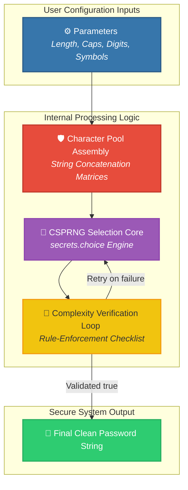

<div align="center">

# 🔑 SecureByte

### A Clean, Customizable, and Cryptographically Secure Password Generation Tool in Python

**SecureByte** is a lightweight, efficient command-line utility built in Python that generates strong, randomized passwords based on specific user requirements. By utilizing a cryptographically secure pseudo-random number generator (CSPRNG) instead of standard pseudo-random modules, the script ensures maximum entropy, helping protect user credentials against brute-force and dictionary attacks.

<p align="center">
  
  
  
</p>

<p align="center">
  <a href="https://github.com/shreeharsh-patil/SecureByte/stargazers"></a>
  <a href="https://github.com/shreeharsh-patil/SecureByte/issues"></a>
  <a href="LICENSE"></a>
</p>

</div>

---

## 🏛️ Program Architecture & Logic Flow

Standard random character selection in Python (via the default `random` module) relies on internal clock states or seed values, which can be predictable over repeated iterations. SecureByte resolves this security risk by using the native `secrets` module, pulling true entropy directly from the underlying operating system kernel (such as `/dev/urandom` on Unix-like platforms or `CryptGenRandom` on Windows).



---

## 🛠️ Key Execution Strategy

| Feature | The Technical Approach | Security Value |
| :--- | :--- | :--- |
| **🎲 Cryptographic Randomness** | Switches random generators from the basic `random` module over to the specialized `secrets` library core. | Generates strings that are statistically non-predictable, preventing attackers from reverse-engineering the sequencing seed. |
| **🛡️ Enforced Character Mix** | Validates the output string against every selected parameter check (e.g., must contain at least one digit if enabled). | Prevents lucky random rolls from outputting weakened variations that happen to leave out entire character groups. |
| **⚙️ Exact Length Controls** | Accepts custom length settings dynamically, allowing passwords to match different application rules effortlessly. | Enables scaling password parameters up past 16+ tokens to hit modern enterprise complexity benchmarks. |
| **💻 Clean Local Context** | Avoids tracking external data, network requests, or saving plain-text session files locally. | Runs completely offline in an isolated local execution scope, eliminating data leakage and network vulnerabilities. |

---

## 🚀 Local Initialization & Usage

### Prerequisites
- **Runtime Sandbox:** Python 3.8 or higher.
- **External Dependencies:** None. This project uses purely native, standard library components.

### Execution Steps

1. **Repository Instantiation**
   Clone the script repository directly into your operating workspace:
   ```bash
   git clone https://github.com/shreeharsh-patil/SecureByte.git
   cd SecureByte
   ```

2. **Standard CLI Invocation**
   Run the file script core within your terminal environment:
   ```bash
   python main.py
   ```

3. **Custom Script Integration**
   You can easily import the generator module directly into other automated Python tools:
   ```python
   from core.generator import SecureByteGenerator

   generator = SecureByteGenerator()

   # Generate a secure 16-character string matching customized parameter maps
   password = generator.generate(
       length=16, 
       include_uppercase=True, 
       include_numbers=True, 
       include_symbols=True
   )

   print(f"Generated String Asset: {password}")
   ```

---

## 📁 Repository Directory Architecture

```text
root
├─ core/                             (Internal Module Space)
│  ├─ __init__.py                    (Package structure boundaries mapping)
│  └─ generator.py                   (Core engine: CSPRNG character pools & checklist loops)
├─ tests/                            (Local Validation Suites)
│  └─ test_generator.py              (Unit verification checks confirming length & entropy rules)
├─ main.py                           (Standard runtime script bootstrap entrypoint)
└─ README.md                         (Unified platform system documentation)
```

---

## ⚖️ Legal Guidelines & Disclaimer

> [!WARNING]
> This utility script is provided under the terms of the MIT License. It operates independently as an isolated software engineering tool built for credential generation testing, password complexity demonstrations, and student software portfolio research. While it utilizes cryptographically sound modules, users remain entirely responsible for their local system security, database encryption layers, and endpoint storage choices.

---

## 👤 Project Author

Developed and Maintained by **Shreeharsh Patil**.

Feel free to contact me or submit issues via:
- **Email:** [shreeharsh.dev@gmail.com](mailto:shreeharsh.dev@gmail.com)
- **GitHub Profile:** [github.com/shreeharsh-patil](https://github.com/shreeharsh-patil)
