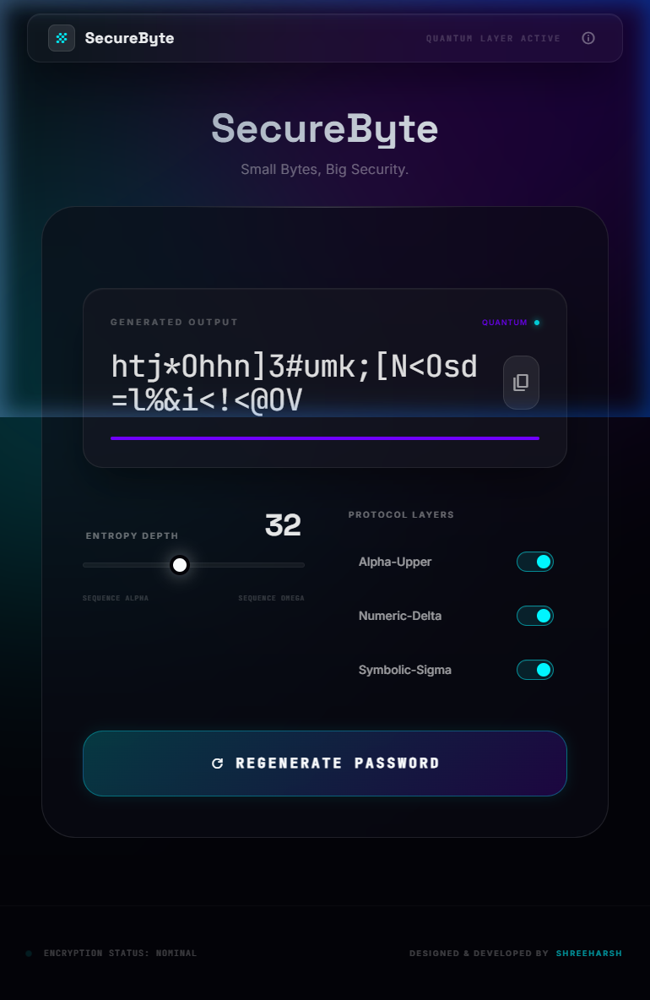

# 🔐 SecureByte — Advanced Password Generator

**“Small Bytes, Big Security.”**

A secure and customizable password generator with a modern web interface and a Python backend. **SecureByte** helps users generate strong, random, and reliable passwords instantly.

---

## 📸 Demo

---

## 📁 Project Structure

SecureByte/
│── Backend/      # Flask API for password generation logic
│── Frontend/     # HTML, CSS, JavaScript interface
│── requirements.txt

---

## ⚡ Quick Start

### 1. Clone the Repository

git clone https://github.com/shreeharsh-patil/SecureByte.git
cd SecureByte

### 2. Install Dependencies

pip install -r requirements.txt

### 3. Run the Backend Server

python Backend/logic.py

### 4. Open the Frontend

Open `Frontend/index.html` in your browser.

---

## ✨ Features

* 🔑 Customizable password length (8–64 characters)
* 🔠 Include/exclude uppercase letters
* 🔢 Include/exclude numbers
* 🔣 Include/exclude special symbols
* ⚡ Real-time password generation
* 📋 Copy to clipboard functionality
* 🌙 Modern dark theme with glassmorphism UI

---

## ⚙️ How It Works

* The backend (Flask) generates secure passwords using random character combinations
* The frontend (HTML/CSS/JS) communicates with the backend and displays results instantly

---

## 📡 API Documentation

See: `Backend/README.md`

---

## 🧪 Example Output

Generated Password: G7@kP!9zQ#

---

## 🎯 Purpose

* Demonstrates full-stack development
* Implements secure password generation
* Shows API communication between frontend and backend
* Focuses on clean UI/UX design

---

## 🚀 Future Improvements

* 🔒 Password strength meter
* 💾 Save password history locally
* 🌐 Deploy as a live web application
* 👤 Add user authentication

---

## 🧑‍💻 Author

Developed by **Shreeharsh Patil**

GitHub: https://github.com/shreeharsh-patil/SecureByte

---

## 🤝 Contributing

Contributions are welcome!

1. Fork the repository
2. Create a new branch
3. Commit your changes
4. Submit a pull request

---

## 📜 License

This project is licensed under the MIT License.

---

## ⭐ Support

If you like this project, give it a ⭐ on GitHub!
